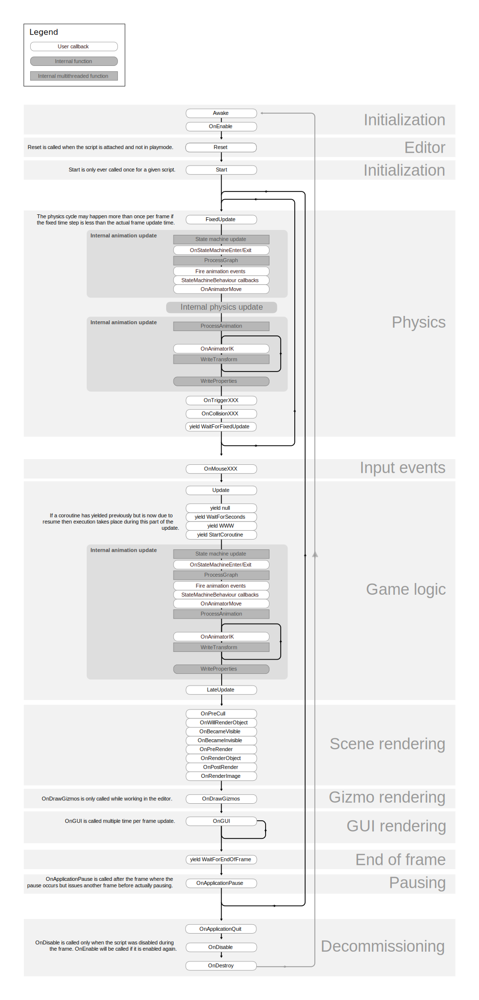

# Data Standards and Serialization

I'm going to approach this from going through real-time systems and then getting into just the basics of data formats and importantly how this all falls under *interoperability.*

## Real-time Systems

Going to breakout three classifications of real-time systems and use the work of some great authors/researchers. The below information is based on the work by Hermann Kopetz book, *'Real-Time Systems', 2011* and on the work by Andrew G. PSaltis in *'Streaming Data',2017*, you may also find other terms being used, ['Hard', 'Firm', and 'Soft'](https://en.wikipedia.org/wiki/Real-time_computing#Real-time_and_high-performance).

1. **Hard:** microseconds-milliseconds
  Think very strict time requirements and generally in embedded systems these are part of vital systems in which if time requirements fail we have a total failure of the system: spaceships, pacemaker, anti-lock brakes.
2. **Soft:** milliseconds-seconds
  Generally these systems can be thought of as social media companies, reservation systems, game chat services, etc.
3. **Near:** seconds-minutes
  Smart home devices, some iOT services, video streaming, etc.

I don't want to get in a back and forth on the differences between soft and near as they are very close together and as systems generally get better and as the internet gets faster these will more than likely combine under one concept.

So why do we care about real-time systems? Well in Unity there are multiple ways to get data, do you need it as fast as possible aka a user input from a controller and what sort of tolerances can our software anticipate in those cases and what ones can we *actually* control? This is why Unity and other game engines run multiple core loops within their engines to guarantee tolerances are hit and also to provide foundational 'time' for you to work with. Point to make here: [Fixed Update vs Update.](https://learn.unity.com/tutorial/update-and-fixedupdate)

## Unity Update vs Fixed Update

Update loop is **NOT** called on a regular timeline - this is really important to understand. Update is running 'as fast as possible' meaning that every frame/loop that Unity processes is directly tied to what's going on within your hardware, software, etc. The time difference between update loops changes each loop and we have no guarantee that Update will maintain a constant interval.



## Unity Structs, Scriptable Objects, Function based concepts, and Package Manager

Most of my recent Unity development has spent more time in Data Oriented Design territory - I would do everything in [DOTS/ECS](https://unity.com/dots) but I also recognize that's overkill for 90% of the applications we are building at VMASC - still worth mentioning and in my opinion for a larger group setup that is planning on continuously building in a Unity environment and want things to be more interoperable I would look into a DOTS/ECS design.

C# Structs and Functions are just as effective in Unity as just about any other programming language. Something to consider if you had developers and/or a team that wasn't necessarily utilizing Unity but was rather up to speed on .NET and you wanted to have some re-use of some code as well a great first step towards being ready for more of a DOTS/ECS based design/solution.

[Scriptable Objects](https://docs.unity3d.com/Manual/class-ScriptableObject.html): if you're not using them, use them. If you have a database and/or already existing data structures you probably don't need them, but they are super great for parameters, settings, and saving data. For example, most of MRTK's profile system is nothing but a bunch of Scriptable Objects - the other reason why you should be using them: very fast to read/write and Unity can manage millions of them. Unity suggests two main use cases for them 1.) Saving and storing data during an Editor session and 2.) Saving data as an Asset in your Project to use at run time. I generally use them in one direction - to read in. You can write to them in the editor but it can cause some issues and I wouldn't do it. In most cases you're using a Scriptable object because you have some sort of configuration and/or data that you want to use the Unity Editor as the interface mechanism. A combination of serialized structs in a Scriptable Object can be very powerful for a wide range of parameter settings, configurations, etc.

---
> VMASC Nugget
>
> [Humble Design Pattern for Unity](https://www.youtube.com/watch?v=3O_rpTWdGps)
---

Unity primarily has classes as components that are attached to their gameobjects, these sort of classes are all derived from the [MonoBehaviour class](https://docs.unity3d.com/ScriptReference/MonoBehaviour.html) and thus are then useable within the Unity Editor/gameobjects. You can also reference other native C# classes and you can bring in compiled dynamic linked libraries *.dll which are a great way to modularize your functions/operations/systems and separate out the work from the data.

**PACKAGE MANAGER** is Amazing - you all should write your own packages and host them internally or remote.

## Serialization

Serialization is taking a data structure/object and encoding it into something a computer can store and/or transfer in a way that if we understand how it was serialized/encoded, we can deserialize/decode it on the other end and get an exact copy of the original data. I'm aware most of you are all probably familiar with this - just wanted to point out that Unity has a nice way for you to flag an item as [serializeable](https://docs.unity3d.com/ScriptReference/Serializable.html) - also very easy to setup and store user settings and/or write a quick way to store a local file if you needed to via a serialized class that you then just the native json serialization built in to convert.

## Singleton Curse

I want to briefly get into a Singleton pattern here - we will spend more time on that coming up - I want to open up how easy it is to use but point out that it's a curse as you scale and can cause a lot of problems. Good to be aware of them - they can be helpful in a pinch but in the long run there are better alternatives - but we are guilty of using them at VMASC all the time because in most cases we aren't dealing with a bottleneck problem and instead it's 99% mainly used for setup and managing order of operations to work in and/around Unity's execution of events.

```C#
//example of a normal C# Unity Singleton Setup
Using UnityEngine;
namespace AFMC.System
{
    
    public class TheClassName:MonoBehaviour 
    {
        
        private static TheClassName _instance;
        public static TheClassName Instance { get { return _instance; } }
        public void Awake()
        {
            if (_instance != null && _instance != this)
            {
                Destroy(this.gameObject);
            }
            else
            {
                _instance = this;
            }
        }
    }
}
```

## Live Unity

* Pull up GitHub Desktop
  * Make sure you're logged in
  * File --> 'New Repository'
    * Make sure you put it in a folder that you know where it is and that it's not in another repository!
    * Name the folder: Game395_firstName_wk2
    * For Readme = yes
    * For gitignore file = Unity
* Pull up Unity Hub
  * New Project
  * At the top of the window make sure it's Editor Version 2022.3.xx (don't worry if it's not the exact one I'm using)
  * Find the 'First Person Core' template and select that.
  * Give it a name Unity_wk2 and make sure the location is in the folder you created on GitHub!
  * Hit Create project
* Let's move the generated *gitignore file
  * As Unity is building the project, go to your folders and navigate to the main/root folder you created for this project.
  * Turn on hidden files
    * Windows: In the fodler tab, go to the view tab, find the 'Hidden items' and make sure to check it
    * Mac: While in the folder, just hit '**command**, **Shift**, and **.**' (period)
  * Find the .gitignore and move it to the root folder of your Unity project in the same folder as where it says 'Assets'
* Back to Unity
  * First thing were going to do!
    * Edit/Preferences...
    * Change our play color!!!
  * Go to File/Build Settings (CTRL,SHIFT,B)
    * Navigate to Player, then under 'Other Settings' scroll down to the bottom where it says 'Active Input Handling*' and change it to both systems. This will automatically restart Unity.
* When Unity restarts: lets go to the Unity Package Manager
  * John Custom Package
    * Go to Window, find Package Manager and hit it
    * In the top left corner, where the plus icon is, use the dropdown arrow to select 'Add Package from git url'
    * >Include raycaster package instead or maybe not...
    * Import the samples after it loads
  * While still in the package manager
    * Navigate over to the Input System package: look for the 'Input Recorder' in the samples, import that.
* Now in your Unity Project tab where you see 'Assets' look for 'Samples/ODU Data Serializer/0.2.0/Data Serialization Example'
* Now this is a little tedious, so watch and read as I go along. For those not familiar with Unity at all - I'm going to show you why I like having the 2 x 3 layout because I like to mess with stuff in the editor
* Proceed to walk through how and what this does
* Navigate to the file we just saved
  * Check your hidden windows folders!
  * Lets open up a JSON file
  * Lets open up a byte array file
* Now back to Unity - find the samples first person controller scene
* Lets add a recorder (we've already imported the samples)

### References

* [Scriptable Objects](https://docs.unity3d.com/Manual/class-ScriptableObject.html)
* [Unity Execution Order](https://docs.unity3d.com/Manual/ExecutionOrder.html)
* [Game Design Program Repo](https://github.com/JShull/GAME395_Unity)
* [Game Design Program Weekly Recaps](https://github.com/ODU-GameStudiesDesign/G395_WeeklyFiles)
